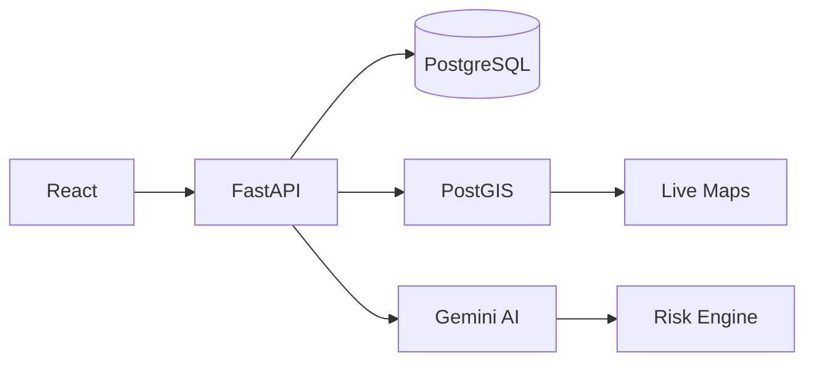

# Hi, I'm Dhanush 👋

---

## Building production-first backend systems.

I enjoy building software that feels like an actual product—not just a demo.

Current interests include **FastAPI services**, **AI agents**, **geospatial intelligence**, **Dockerized deployments**, and **PostgreSQL architecture**.

---

## Engineering Snapshot

|               |                                 |
| ------------- | ------------------------------- |
| **Role**      | Backend Engineer                |
| **Focus**     | AI Systems & Infrastructure     |
| **Languages** | Python · TypeScript · SQL       |
| **Backend**   | FastAPI · Flask                 |
| **Database**  | PostgreSQL · PostGIS            |
| **DevOps**    | Docker · Linux · GitHub Actions |

---

## Architecture

---

## Featured Work

### Avana V2

> AI Safety Intelligence Platform

* Multi-agent AI workflow
* PostGIS risk engine
* Safe route computation
* Live incident dashboard
* FastAPI backend

**Stack**

`FastAPI` `PostGIS` `React` `Docker` `Gemini AI`

---

### GreenOps

> Distributed Monitoring Platform

A telemetry platform for heartbeat tracking, uptime monitoring, and energy analytics across distributed infrastructure.

**Stack**

`Python` `FastAPI` `PostgreSQL` `Docker`

---

### Little Heartbeat

> Hackathon Runner-Up

Built in under 48 hours with AI-assisted workflows and real-time backend services.

**Stack**

`React` `Express` `Supabase` `Gemini AI`

---

## Achievements

* 🏆 Top 5 Finalist — National AI Hackathon (SJBIT)
* 🥈 Runner-Up — GMIT State Hackathon
* 🥇 CodeNeura Inter-College Winner
* 🥇 Green IT Competition Winner
* 🚀 EY Techathon Round 2

---

## Tech Stack

### Languages

### Backend

### Database

### Tools

---

## GitHub Activity

<table>
<tr>
<td width="50%" valign="top">

### 🔥 Current Streak

</td>

<td width="50%" valign="top">

### 📈 Contribution Stats

</td>
</tr>
</table>

 

 

---

## Open Source

I enjoy contributing to backend tooling, API improvements, documentation, and performance optimizations.

---

**Let's build something meaningful.**

