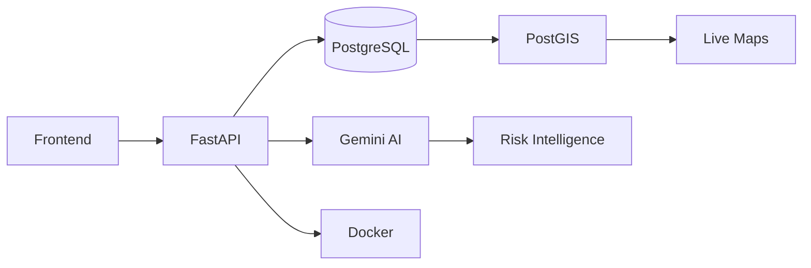

# DHANUSH D PRABHU

---

# Engineering Philosophy

I build **production-first backend systems**, **AI-powered platforms**, and **geospatial intelligence applications**.

Instead of focusing on demo projects, I build systems that resemble real products—modular APIs, containerized deployments, scalable databases, and AI pipelines designed for actual usage.

<table>
<tr>
<td width="50%">

### Current Focus

- FastAPI Architecture
- AI Agent Workflows
- Geospatial Intelligence
- Distributed Systems
- Docker Deployments
- Open Source

</td>

<td width="50%">

### Core Strengths

- API Design
- PostgreSQL & PostGIS
- Docker
- System Architecture
- Team Leadership
- Rapid Execution

</td>
</tr>
</table>

---

# Architecture Mindset

---

# Flagship Project

## Avana V2 — AI Safety Intelligence Platform

> National Level AI Hackathon Finalist • Team Leader • Backend Architect

<AsyncImageGroup query={["Avana V2 safety intelligence dashboard UI","Avana V2 hackathon presentation team"]} layout=carousel/>

A production-oriented safety intelligence platform that combines **FastAPI**, **PostGIS**, and **Gemini AI** to analyze incidents, calculate geographic risk scores, and generate actionable intelligence.

### Features

- AI-powered incident classification
- Multi-agent intelligence pipeline
- Risk scoring engine
- Live heatmaps
- Safe route computation
- JWT Authentication
- Async FastAPI architecture

### Stack

<row gap=1 wrap=wrap align=center>
  <badge label="FastAPI" color=info/>
  <badge label="PostGIS"/>
  <badge label="PostgreSQL"/>
  <badge label="React"/>
  <badge label="TypeScript"/>
  <badge label="Tailwind"/>
  <badge label="Docker"/>
  <badge label="Gemini AI"/>
</row>

---

# Featured Projects

<grid columns=2 gap=3><grid-item><box background=surface radius=xl padding=3 gap=2 border=1 clip>
    <AsyncImage query="GreenOps dashboard monitoring energy platform" aspectRatio="5:3" width="100%" maxHeight=220 radius=lg/>
    <box gap=1>
      **GreenOps**

      <caption>Distributed Monitoring Platform</caption>
    </box>

    Telemetry system for heartbeat tracking, energy analytics, and infrastructure monitoring.

    <row gap=1 wrap=wrap><badge label=Python/><badge label=FastAPI/><badge label=Docker/><badge label=PostgreSQL/></row>
  </box></grid-item><grid-item><box background=surface radius=xl padding=3 gap=2 border=1 clip>
    <AsyncImage query="Little Heartbeat app UI pregnancy support platform" aspectRatio="5:3" width="100%" maxHeight=220 radius=lg/>
    <box gap=1>
      **Little Heartbeat**

      <caption>Hackathon Runner-Up</caption>
    </box>

    AI-assisted community support platform built within 48 hours.

    <row gap=1 wrap=wrap><badge label=React/><badge label=Express/><badge label=Supabase/><badge label="Gemini AI"/></row>
  </box></grid-item></grid>

---

# Achievements

<list gap=3 maxMarkerSize=lg marker=bullet><list-item marker={<icon name=trophy color=info size=lg/>}>
  **Top 5 Finalist**

  National Level AI Hackathon — SJBIT Bengaluru
</list-item><list-item marker={<icon name=medal color=info size=lg/>}>
  **Runner-Up**

  State Level Hackathon — GMIT Davangere
</list-item><list-item marker={<icon name=award color=info size=lg/>}>
  **1st Place**

  CodeNeura Inter-College Tech-a-Thon
</list-item><list-item marker={<icon name=leaf color=info size=lg/>}>
  **1st Place**

  Green IT Competition
</list-item><list-item marker={<icon name=sparkles color=info size=lg/>}>
  **Round 2**

  EY Techathon
</list-item></list>

---

# Tech Arsenal

### Languages

<row gap=1 wrap=wrap align=center><badge label=Python/><badge label=TypeScript/><badge label=JavaScript/><badge label=SQL/><badge label=Bash/></row>

### Backend

<row gap=1 wrap=wrap align=center><badge label=FastAPI/><badge label=Flask/><badge label="REST APIs"/><badge label=JWT/></row>

### Databases

<row gap=1 wrap=wrap align=center><badge label=PostgreSQL/><badge label=PostGIS/><badge label=SQLAlchemy/><badge label=Supabase/></row>

### Frontend

<row gap=1 wrap=wrap align=center><badge label=React/><badge label=TypeScript/><badge label=Tailwind/></row>

### DevOps

<row gap=1 wrap=wrap align=center><badge label=Docker/><badge label="GitHub Actions"/><badge label=Linux/><badge label=Git/><badge label=Postman/></row>

---

# GitHub Analytics

<box gap=3 align=center>
  <AsyncImage query="GitHub stats card dark theme username iamdevdhanush" aspectRatio="2:1" width="100%" maxHeight=220/>
  <AsyncImage query="GitHub streak stats dark theme username iamdevdhanush" aspectRatio="2:1" width="100%" maxHeight=220/>
  <AsyncImage query="GitHub activity graph dark theme username iamdevdhanush" aspectRatio="2:1" width="100%" maxHeight=220/>
</box>

---

# Open Source

I enjoy contributing to projects that improve developer tooling and backend infrastructure.

**Contribution Areas**

- Backend bug fixes
- API improvements
- Documentation
- Testing
- Performance optimization

---

# Let's Build Something

### Open to collaborations, hackathons, and engineering opportunities.

